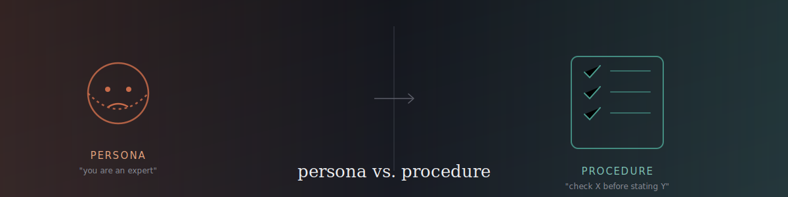
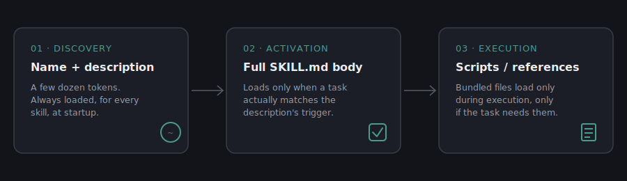

# Why Your Prompt's Persona Doesn't Work
### (And What To Do Instead)

**A practical guide to writing effective `SKILL.md` files for AI agents**
*Grounded in research on why "act as an expert" prompting falls short — and why procedural instructions work better.*

---

## Table of Contents

1. [The Problem: "Act as an Expert" Doesn't Do What You Think](#1-the-problem-act-as-an-expert-doesnt-do-what-you-think)
2. [Why It Happens: Identity vs. Procedure](#2-why-it-happens-identity-vs-procedure)
3. [Honest Caveat: The Evidence Is Contested](#3-honest-caveat-the-evidence-is-contested)
4. [What Agent Skills Are](#4-what-agent-skills-are-and-why-the-format-fits-this-problem)
5. [Anatomy of a Good SKILL.md](#5-anatomy-of-a-good-skillmd)
6. [Worked Example: Epistemic Honesty Skill](#6-worked-example-building-a-skill-for-epistemic-honesty)
7. [Does It Actually Work? A Small, Honest Comparison](#7-does-it-actually-work-a-small-honest-comparison)
8. [How to Test Your Own Skill](#8-how-to-test-your-own-skill)
9. [Quick-Reference Checklist](#9-quick-reference-checklist)

---

## 1. The Problem: "Act as an Expert" Doesn't Do What You Think

If you've written prompts for an AI model, you've probably done this: started with *"You are a senior software engineer"* or *"Act as an expert data analyst,"* expecting the model to perform better because it's been told who to be.

Recent research complicates this. A 2026 study from the University of Southern California tested six models across style, factual accuracy, and safety-related tasks, and found a clear split: expert personas tend to help with tone and alignment, but tend to hurt accuracy on knowledge-heavy and reasoning-heavy tasks — the exact tasks most people reach for a persona to improve. A separate 2026 report from the Wharton School tested graduate-level science, engineering, and law questions across six models and found that assigning an in-domain expert persona (*"you are a physics expert"*) produced no reliable accuracy improvement in most models, while low-knowledge personas (assigning the model a "child" or "layperson" role) reliably made things worse.

> **Put plainly:** telling a model to sound like an expert is not the same as helping it think like one. Sounding right and being right are different outcomes, and persona prompting mostly buys you the first one.

---

## 2. Why It Happens: Identity vs. Procedure

A language model doesn't have a separate "knowledge module" that switches on when you assign it a role. It generates text by predicting, one piece at a time, what's statistically likely to come next given everything written so far. There's one process — pattern completion over a huge trained distribution — not a costume closet it can step into.

When you write "you are a senior developer," you're not pointing the model at a specific stored body of expertise. You're nudging it toward a *style* of completion: more confident phrasing, fewer hedges, technical vocabulary, decisive-sounding claims. Researchers call the measurable version of this **confidence amplification** — persona prompts concentrate the model's output around fewer, more assertive-sounding answers.

That's genuinely useful when the task is about tone. It's a liability when the task is about correctness, because confidence and correctness are not the same thing. A model can become more confident-sounding without becoming more accurate.

This is the core distinction the rest of this guide is built on:

| | Persona prompt | Procedural instruction |
|---|---|---|
| **What it specifies** | An identity (*"you are an expert in X"*) | A step (*"check whether a claim comes from one study or several before stating it"*) |
| **What it changes** | Tone, confidence, vocabulary | The actual sequence of actions taken |
| **How you'd know it worked** | The output *sounds* more authoritative | The output *does* something checkable — cites a source type, flags a gap, follows a specific format |

"Act as an expert" describes a character. It doesn't say what to check, in what order, or against what standard. "State whether a claim comes from one study or a consensus" is a step — it tells the model exactly what to do, and you can verify afterward whether it did it. That difference — **identity versus procedure** — is what the rest of this guide operationalizes.

---

## 3. Honest Caveat: The Evidence Is Contested

> **This section is deliberately not softened.** It exists so the guide's advice doesn't depend on winning a research debate that isn't settled.

Not everyone agrees that persona prompting reliably hurts accuracy. A 2026 rebuttal paper argued that the Wharton study's null result may have been an artifact of its own design — the "neutral" baseline it compared against wasn't actually neutral (it already described the model as "a very intelligent assistant," itself a kind of competence framing), personas were placed later in the prompt than the baseline identity, and the evaluation format required single-letter answers, which suppresses the reasoning process a persona might otherwise activate. When the authors reran a version of the test correcting for these issues, expert personas performed measurably better than baseline on the same benchmark.

This doesn't settle the debate — it shows the debate is live, and that the *same* persona-prompting technique can look helpful or harmful depending on exactly how it's implemented: where it sits in the prompt, how it's phrased, what temperature setting is used, how output is scored.

That instability is actually the practical takeaway. If a technique's effect flips direction based on implementation details a typical user doesn't control or even see, it's not something to build a reliable system on — **regardless of which side of the persona debate turns out to be right.** That's the real argument for the procedural approach this guide teaches: instructions that specify exact steps don't depend on getting subtle prompt-placement details correct to work.

---

## 4. What Agent Skills Are (And Why the Format Fits This Problem)

Anthropic released the Agent Skills format publicly via [`github.com/anthropics/skills`](https://github.com/anthropics/skills) in October 2025. The format has since become an open standard maintained at [agentskills.io](https://agentskills.io), adopted beyond Claude by tools including GitHub Copilot, VS Code, Cursor, OpenAI Codex, and Gemini CLI, among others.

A Skill is a folder containing a `SKILL.md` file — YAML frontmatter plus markdown instructions — and, optionally, bundled scripts, reference docs, and template assets. What makes the format matter for the problem in Section 2 is *how* it loads content into the model's context, in three stages:

The agent only ever loads what a task actually calls for. At startup, it sees just a skill's name and description — a few dozen tokens. Only when a task matches does the full body load. Reference files and scripts, if the skill has any, load only during execution, only if needed.

This structure has a direct consequence for the persona-vs-procedure question: **a Skill has nowhere to put a vague identity claim that would do any work.** The description field's job is to say *when* to trigger, not to describe a character. The body's job is to specify what to actually do. There's no equivalent of "you are a world-class expert" sitting in a system prompt hoping to shift the model's tone — every word in a `SKILL.md` is either a trigger condition or an instruction, which is exactly the procedural discipline Section 2 argues for.

---

## 5. Anatomy of a Good SKILL.md

### 5.1 The frontmatter

Every `SKILL.md` needs two fields: `name` and `description`. The description is the *only* thing loaded before a skill triggers, so it has to do two jobs at once: say what the skill does, **and** say when to use it — including phrasings a real user might actually type, not just a topic label.

| | Example |
|---|---|
| ❌ **Weak description** | `Helps write accurate research summaries.` |
| ✅ **Strong description** | `Summarize or explain research findings, studies, or claims in a way that preserves uncertainty, source disagreement, and evidence quality instead of flattening them into confident one-line conclusions. Use this whenever the user asks to summarize a study, "what does the research say," explain findings from multiple sources, or compare conflicting studies/reports — especially on contested, fast-moving, or single-study topics where overstating certainty would mislead the reader.` |

The weak version just restates the name — it gives the model no concrete signal for *when* to reach for the skill instead of answering normally. The strong version names the specific failure it prevents, lists concrete phrasings a user would type, and flags the situation where it matters most. **That specificity is what makes a description a trigger rather than a label.**

### 5.2 The body

Write instructions as concrete, checkable actions — not character description.

| | Example |
|---|---|
| ❌ **Vague** | *"Be careful and thorough when summarizing research."* |
| ✅ **Concrete** | *"State whether a claim comes from a single study or a consensus of multiple independent sources."* |

The concrete version can be checked — you can look at an output and determine whether it did or didn't state that distinction. The vague version can't; "be careful" doesn't specify an action, so there's nothing to verify.

> **A useful test while drafting a skill:** for each instruction, ask *"could I check whether the model actually did this?"* If the answer is no, it's still persona language wearing a procedural disguise.

### 5.3 Progressive disclosure in practice

Keep the main `SKILL.md` body focused on the core procedure. If a skill needs extensive reference material — a large lookup table, a long list of edge cases, format-specific detail — move it into a separate file in a `references/` folder and point to it from the body (*"see `references/edge-cases.md` for handling ambiguous source types"*). This keeps the always-loaded portion small while still giving the model somewhere to go for depth when a task actually needs it.

---

## 6. Worked Example: Building a Skill for Epistemic Honesty

To make this concrete, this repo includes a full example skill: **[`examples/epistemic-honesty-summary/SKILL.md`](examples/epistemic-honesty-summary/SKILL.md)** — one that helps produce research summaries which accurately represent uncertainty, rather than collapsing everything into confident-sounding claims (the exact failure mode from Section 1).

**The problem it targets:** the default failure when summarizing research is flattening — multiple sources with different sample sizes and disagreeing conclusions get compressed into "studies show X," which reads well but overstates how settled X actually is.

**The frontmatter** uses the strong-description pattern from Section 5.1 — it names the failure mode and lists concrete trigger phrasings, rather than a generic label.

**The key mechanism** is a table inside the skill body that maps evidence strength directly to allowed phrasing:

| Evidence tag | Allowed phrasing | Disallowed phrasing |
|---|---|---|
| **Consensus** | "X is well-established," "multiple independent studies find X" | — |
| **Single study** | "One study found X" / "According to [source], X" | "Research shows X," "studies confirm X" |
| **Contested** | "Sources disagree: [A] finds X, while [B] finds Y" | Picking one side and presenting it as the answer |
| **Preliminary** | "Early/preliminary evidence suggests X, not yet replicated" | "X has been shown" |

This is what a procedural instruction looks like in practice. It doesn't tell the model to *be* rigorous — it gives a direct, checkable rule: before writing "studies show," check which row applies, and use only the phrasing that row allows.

The skill also includes a step most persona prompts skip entirely: naming disagreement between sources directly, rather than averaging conflicting findings into a middle-ground claim that neither source actually makes. And it includes an explicit boundary — the skill is **not** "hedge everything." A well-established finding should be stated plainly and confidently; under-claiming settled science is its own form of inaccuracy. Matching confidence to evidence has to work in both directions.

---

## 7. Does It Actually Work? A Small, Honest Comparison

To test whether this actually changes anything, three questions were run through two conditions each: a bare "act as a research analyst" persona prompt, and the same question following the skill's steps.

| Question | Type | Persona prompt result | Skill-following result |
|---|---|---|---|
| Fasting & longevity | Contested / single-study | Flattened animal and human evidence into one confident claim | Explicitly separated evidence types, named the gap |
| Smoking & lung cancer | Genuine consensus | Confident and accurate — no issue | Equally confident and accurate — no meaningful difference |
| Screen time & mental health | Active disagreement | Presented one side as settled; implied unsupported causation | Named specific disagreeing sources and a plausible reason for the disagreement |

- **Q1 — contested/single-study topic:** *"What does the research say about intermittent fasting and longevity?"* The persona prompt stated a firm human-lifespan benefit that current research doesn't actually support — blending strong animal-study evidence with thin human evidence into one confident claim. The skill's version separated the two explicitly and named that direct human lifespan data doesn't exist yet.
- **Q2 — genuine consensus (checking the skill doesn't over-hedge):** *"Does smoking cause lung cancer?"* Both versions answered plainly and confidently, with no false hedging. This is the important negative-ish result: on settled science, the plain persona prompt performed just as well.
- **Q3 — actively disagreeing sources:** *"Does screen time cause mental health problems in teenagers?"* The persona prompt presented one side of a genuinely disputed question as settled fact, and implied causation the underlying studies don't establish. The skill's version named specific contradicting studies (including a meta-analysis finding no reliable correlation, and a genetically-informed study complicating the causal picture) and explained why they might diverge.

### ⚠️ Limitations of this comparison

**This is illustrative, not rigorous evidence, and it's worth being direct about why:** it's a single run per condition per question, graded by the same person who wrote the skill (not blind), across only three questions. There's real risk of unconscious bias toward making the skill look good, since nothing here was checked by an independent grader or repeated for variance.

What would be needed to call this real evidence rather than illustration: multiple runs per condition to check consistency, blind or programmatic grading (for example, a script flagging "studies show" language automatically rather than a human eyeballing it), and a larger, more varied set of test questions. Anthropic's own `skill-creator` tool, part of the official Agent Skills repository, is built around exactly this kind of rigor — running skill and baseline conditions in parallel, grading against explicit assertions, and reviewing outputs before trusting aggregate scores. Section 8 below walks through a scaled-down version of that same process.

---

## 8. How to Test Your Own Skill

You don't need a full evaluation framework to sanity-check a skill you've written. A minimal version of the process:

1. **Write 2–3 realistic test prompts** — the kind of thing a real user would actually type, covering different situations the skill is meant to handle (including at least one case where the skill *shouldn't* change much, to check it doesn't overcorrect).
2. **Run each prompt twice** — once with the skill, once without (or against a bare persona prompt, if that's the comparison you care about) — and save both outputs.
3. **Check against concrete, checkable criteria** — not "does this feel better," but specific yes/no questions: did it use overconfident phrasing where it shouldn't have? Did it distinguish evidence types where relevant? Did it name disagreement directly rather than blending it away?
4. **Read the actual outputs before trusting any score.** A skill can pass a narrow checklist and still produce something subtly wrong in a way the checklist didn't anticipate — this is why human review of real output text matters, not just pass/fail counts.
5. **Iterate.** If something failed, revise the specific instruction that should have prevented it, then rerun the same test prompts to confirm the fix worked without breaking anything else.

For a more rigorous version of this loop — with parallel baseline runs, programmatic grading, and a side-by-side review interface — see the `skill-creator` skill in Anthropic's official [Agent Skills repository](https://github.com/anthropics/skills).

---

## 9. Quick-Reference Checklist

- [ ] Does your description say **when** to trigger, not just what the skill does?
- [ ] Is every instruction in the body **checkable** — could you look at an output and tell whether the model followed it?
- [ ] Would confident-but-unsupported phrasing (like "studies show" or "research confirms") survive your own read-through of the skill's output?
- [ ] Does the skill still let the model state **well-established facts plainly**, without forcing unnecessary hedging?
- [ ] Have you tested the skill against a baseline — even a small, informal one — rather than assuming it works?
- [ ] Is anything in the body actually a persona in disguise (*"be a rigorous analyst"*) rather than a concrete step?

---

<!-- 

*This guide documents a full research-to-build process — problem, mechanism, worked example, and an honest evaluation of the result.*

 -->
